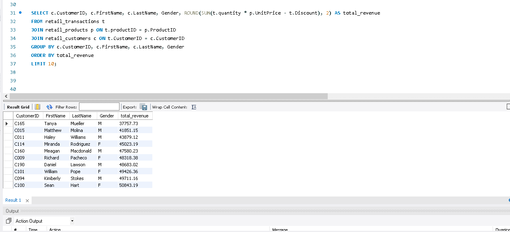

# Retail Sales Analysis SQL Project

This repository contains SQL queries for analyzing an Retail sales dataset. The dataset includes transaction-level data, product information, and customer details. The project focuses on extracting business insights such as sales performance, top-selling products, revenue trends, and customer behavior.

## Dataset Overview

- **Transactions Table**: Records each sale with `TransactionID`, `ProductID`, `CustomerID`, `Quantity`, `Discount`, `TransactionDate`.
- **Products Table**: Contains `ProductID`, `ProductName`, `Category`, `UnitPrice`, `CostPrice`.
- **Customers Table**: Contains `CustomerID`, `FirstName`, `LastName`, `Gender`, `City`, `JoinDate`.
- **Stores Table**: Contains `StoreID`, `StoreName`, `City`, `Region`.

## SQL Queries

1. **Total Revenue per Product**
   - Calculates total revenue per product after accounting for discounts.
   - Example: `SELECT ProductName, SUM(Quantity * UnitPrice - Discount) AS total_revenue FROM transactions ...`

2. **Best-Selling Products**
   - Ranks products based on total quantity sold.

3. **Average Sales per Customer**
   - Identifies high-value customers by calculating average transaction value per customer.

4. **Revenue per Store**
   - Shows total revenue generated per store, helping to identify top-performing locations.

5. **Revenue by Customer Demographics**
   - Examines total revenue by customer gender or city to inform marketing strategies.

6. **Yearly Revenue Trends**
   - Tracks revenue changes across years to identify seasonal or annual performance patterns.
7. **Top 10 customers**
    - For revenue forecasting, business decision making and loyaly programs.

## Key Insights

- Identified top-selling products and top-revenue-generating stores.
- Segmented customers by spending habits  as well gender to pinpoint high-value customers.
- Analyzed revenue trends over time to guide inventory and marketing decisions.

## How to Use

- Clone the repository.
- Open `.sql` files in any SQL client (MySQL, PostgreSQL, etc.).
- Execute queries on your Amazon sales dataset.
- Modify queries to explore additional insights or trends.

**Query Screenshot Preview**

## My Contact
**Crystal Obidike**  
Frontend Developer | Data Analyst  
📩 Email: [crystalobidike@gmail.com] 
